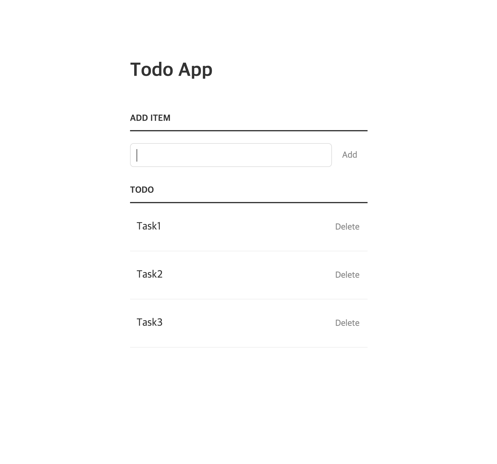
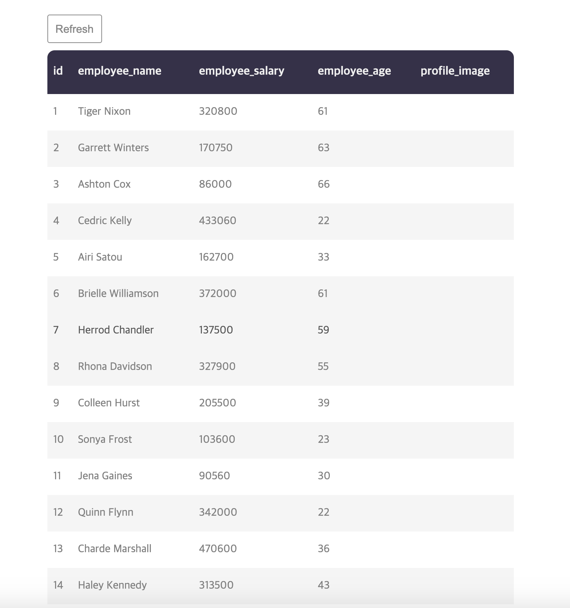
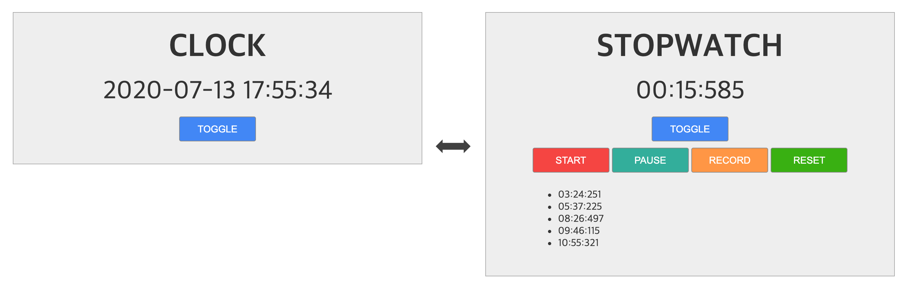

# ojt

On-the-job training

**참고 사항**

- 학습 전에 항상 브랜치를 생성합니다.
  - ojt/{subject}
- commit 은 일관성이 유지되는 최대한 작은 단위로 합니다
  - commit 메시지 작성법 참고
    - https://meetup.toast.com/posts/106
    - https://blog.ull.im/engineering/2019/03/10/logs-on-git.html
- 항상 1일 1PR 하도록 합니다.
- PR 작성시 해당 내용에 대한 코멘트를 작성합니다.

## 4-1. Git basic

- http://learngitbranching.js.org/
  - 우선 해당 사이트의 코스를 모두 통과 한다. (2~3시간 이내 학습 가능)
- Git 스터디 및 실습
  - Fork, clone
  - branch, checkout
  - commit, push
  - Pull Request
  - fetch, pull, rebase, merge

## 4-2 Web basic

아래 주제에 대하여 학습 후 마크다운 형식으로 작성합니다.

**주제**

- HTML5
- JavaScript
- ECMAScript (ES6, ES2016, ES2017…)
- Node.js
  - npm
  - package.json
  - module
- Babel

**학습 참고 사이트**

- https://poiemaweb.com/
- https://opentutorials.org/course/3085
- 기타 ...

### Works

**How to do work**

- 요구사항에 맞게 HTML, CSS, JS를 생성합니다.
- 구현이 끝난 branch를 PR(pull request). PR은 최종본 하나만 보냅니다.
- PR 코멘트에 내용을 작성합니다.

**Requirements:**

- 외부 JS 프레임웍, 라이브러리, CSS, 마크업 컴포넌트 등을 사용하지 않습니다.
- vanilla js, ECMAScript 2015(ES6)을 사용합니다.
- HTML 마크업의 body 에는 //div[@id='root']인 DOM 하나만 추가하고 모든 DOM은 JS로 동적 제어합니다.

**(work.1) localStorage 를 사용한 todo 리스트 작성**

- 인풋박스를 통해 텍스트 입력과 엔터키와 버튼으로 작성 완료를 합니다.
- 입력된 텍스트는 목록으로 보여지며 localStorage 에 저장됩니다.
- 작성된 todo 아이템의 Delete 버튼을 클릭하면 localStorage 에 삭제됩니다.
- 작성과 삭제는 동적 화면으로 페이지 새로고침 없이 구현되야 합니다.

**(work.2) fetch 를 이용해서 API 호출 하기**

- fetch 함수를 이용해서 웹상의 json 을 호출합니다.
- 호출 주소는 다음과 같습니다. http://dummy.restapiexample.com/api/v1/employees
- 가져온 데이터는 table 의 header, body 를 이용해서 정돈하여 보여줍니다.
- 버튼을 클릭하여 페이지의 새로고침 없이 데이터를 새로고침 해야합니다.

**(work.3) Date 의 prototype 을 확장하여 시계 만들기**

 - Date 의 prototype 을 확장한 새로운 함수를 작성합니다.
 - 시간은 초 단위까지 표시하며 동적으로 변화하는 시계를 구현합니다.
 - 버튼을 클릭해서 시간 표시와 타이머 스위칭하여 보여줄수 있어야합니다.
 - 타이머는 ms 단위로 보여지며 스톱 기능과 랩타임 기능을 구현합니다.
