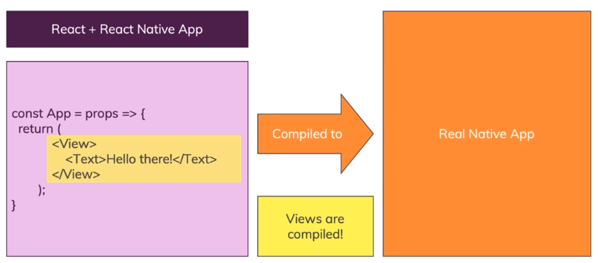
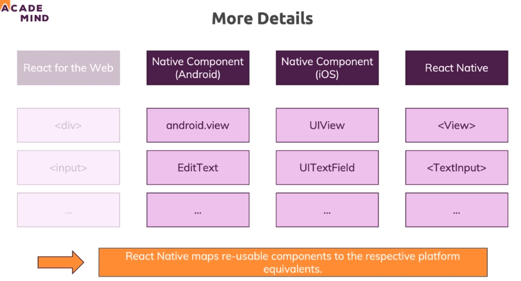

## React-Native

리액트 네이티브(React Native)는 페이스북이 개발한 `오픈 소스 모바일 애플리케이션 프레임워크`.

react native를 사용하면 real native apps를 개발할 수 있음. 즉, Javascript와 React Library를 사용해서 안드로이나 iOS 모두 개발할 수 있음.

 

#### 특징

- A collection of "special" React components (특별한 React 컴포넌트들의 집합)

- Components compiled to Native Widgets (이러한 컴포넌트들은 컴파일을 통해 Native 위젯으로 변환)
- Naitve platform APIs exposed to Javascript (자바스크립트로 Native 플랫폼 API, 예를 들어 카메라/위치정보 등의 API를 쓸 수 있음)

 

#### 동작 방법

- React 문법에 약간에 React Native가 추가된 코드. 이를 컴파일하면 알아서 Real Native App 으로 변환되어집니다.

 

- 위 그림은 어떤식으로 진행되는지 보여주는 그림인데 React Native에서 TextInput을 쓰면 이는 곧 안드로이드에서는 EditText와 같고, iOS에서는 UITextField와 동일한 의미를 가지도록 만들어져 있음.

- 중요한건 `UI는 컴파일을 통해 native views로 변환`되지만, 로직은 자바스크립트로 실행 됨. 그래서 자바스크립트 로직을 그대로 사용할 수 있다는 장점이 있음.
