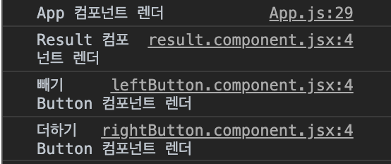

### react에서의 상태관리와 Redux

---

#### 1. React에서의 상태 관리

- react로 application을 만들 때 필수적으로 상태를 관리하는 상황을 마주하는데 기본적으로 `state`에 기본 값을 지정하고 `useState`를 사용해서 data를 추가, 제거, 수정함
  <br>
- 독립적인 컴포넌트내에서 뿐만 아니라 부모-자식, 부모-자식-자식의 자식- 자식의 자식의 자식, 혹은 그 역순과 사돈/팔촌 관계끼리도 state를 공유하고 수정하고 다시 공유할 수 있음
  <br>
- `state`를 `props`로 서로 넘겨주며 data를 공유하고 `useState`를 통해 data를 수정하는 등 간단한 방법으로 React에서 상태 관리를 할 수 있지만 application의 규모가 복잡해지고 커질수록 상태 관리는 더욱 더 힘들어짐.

### 1.1 React의 특성: &nbsp; 렌더링 조건

1. props가 변경되었을 때
2. state가 변경되었을 때
3. 부모 컴포넌트가 렌더링 되었을 때
   > 렌더링이란 : 컴포넌트를 view로 보여주는 작업

어플리케이션 속 각각의 컴포넌트들은 `props`와 `state`가 변경될 때 그리고 그 컴포넌트의 부모 컴포넌트가 렌더링되었을 때 다시 렌더링이 됨

- ##### example>

```js
//App.js

import React from "react";
import "./App.css";

import RightButton from "./components/rightButton.component";
import LeftButton from "./components/leftButton.component";
import Result from "./components/result.component";

class App extends React.Component {
  constructor(props) {
    super(props);
    this.state = {
      value: 0,
    };
  }

  handleIncrease = () => {
    this.setState({
      value: this.state.value + 1,
    });
  };
  handleDecrease = () => {
    this.setState({
      value: this.state.value - 1,
    });
  };

  render() {
    return (
      <div className="App">
        <Result sum={this.state.value} />
        //현재 값을 보여주는 component
        <LeftButton decreasing={this.handleDecrease} />
        //클릭 할 때 마다 숫자를 1씩 감소시키는 컴포넌트
        <RightButton increasing={this.handleIncrease} />
        //클릭 할 때 마다 숫자를 1씩 증가시키는 컴포넌트
      </div>
    );
  }
}

export default App;

// result.js
import React from "react";

const Result = (props) => {
  return <div>{props.sum}</div>;
};

export default Result;

//leftButton.js
import React from "react";

const LeftButton = (props) => {
  return (
    <button type="button" onClick={props.decreasing}>
      빼기
    </button>
  );
};

export default LeftButton;

//rightButton.js
import React from "react";

const RightButton = (props) => {
  return (
    <button type="button" onClick={props.increasing}>
      더하기
    </button>
  );
};

export default RightButton;
```

위 처럼 `<Result />`, `<LeftButton />` 그리고 `<RightButton />`라는 3개의 자식 컴포넌트를 가지고 있는 App 컴포넌트로 구성된 어플리케이션이 있으면 이 어플리케이션의 유저가 view에서 `RightButton` 컴포넌트속에 있는 "더하기" 버튼을 클릭하면 세 가지의 일이 발생함

1. `handleIncrease` 라는 eventhandler가 작동하여 `App` 컴포넌트의 `state` 속 `value`의 값이 0 에서 1로 변경되고 그럼으로 `App` 컴포넌트가 다시 렌더링 된다.
   <br>
2. `Result` 컴포넌트의 `props`인 `this.state.value`가 변경되었음으로 `sum`의 이름으로 넘어가는 `props`가 변경된다. 그럼으로 `Result` 컴포넌트가 렌더링 된다.
   <br>
3. `App`컴포넌트가 렌더링 되었음으로 그 자식 컴포넌트들인 `<Result />`, `<LeftButton />` 그리고 `<RightButton />` 모두가 다시 렌더링 된다.

<p align="center">

</p>

이렇게 렌더링 조건 중 <b>1번 Props가 변경되었을 때 2번 State가 변경되었을 때 3번 부모 컴포넌트가 렌더링되었을 때</b> 이 세가지를 충족하기 때문에 위와 같은 렌더링이 발생하게 되는 것이다.

<br>

### 1.1 React의 특성: &nbsp; 불필요한 렌더링

- 렌더링이란 컴포넌트를 view로 보여주는 작업
- 렌더링 결과의 영향이 없음에도 불구하고 리렌더링이 되는 것은 매우 불필요하며 application의 성능 손실의 가장 큰 원인
- 1번-2번-3번-4번-5번의 depth로 되어있는 부모-자식의 컴포넌트가 있고 렌더링의 영향을 주는 컴포넌트가 1번과 5번이라고 가정하면 2,3,4번의 컴포넌트는 단지 1번의 `state`를 `props`로 넘겨주기만 하고 그들의 view에 영향을 주지 않음에도 불구하고 1번의 `state`가 변경된다면 `props`가 변경되었다는 조건 때문에 불필요한 렌더링이 발생하게 됨
- 이 뿐만 아니라 규모가 커질수록 data flow는 복잡해지기도 하며 버그나 오류에 대한 트랙킹이 불가능해 질 수 있음.
- 이러한 복잡성과 성능손실을 개선하기 위해 redux를 사용

---

## 2. Redux

> Redux는 React (뿐만 아니라 다른 라이브러리나 프레임워크)에서 사용 가능한 application 상태관리 library이다. 여러개의 middleware들도 제공하며 대표적으로 logger, thunk, saga, persist 등이 있다.

- redux는 application 전체의 상태(state)를 편리하게 관리하기 위해 사용하는 라이브러리 중 하나
