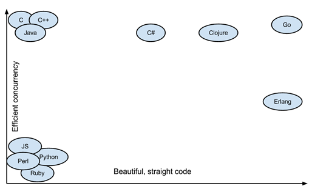

## Ch1. 시작하기에 앞서

<br />

### 1. 강의 대상

- 기본적으로 c언어를 기반으로 C++, Java, Python과 같은 객체 지향 언어들의 장점을 뽑아 만듬
- 절차 지향(함수)의 개념과 객체 지향(클래스)의 개념이 어느정도 있는 학생이 수강해야 이해가 빠를 것
- 이 강의는 딱딱한 형식으로 개념을 나열하지 않고 개념을 말로 설명하듯 풀어 적었습니다

<br />

### 1-1. <b>이 강의의 기본 방향</b>

- 기본 개념을 바로 예시 코드로 실행해보면서 학습할 수 있도록 구성했습니다.
- 다른 언어들과 차이점을 기준으로 Go언어만의 특징을 중점적으로 설명했습니다.
- `구름 IDE`를 기본 개발 환경으로 설명
  > 구름 IDE: 구름IDE는 웹 기반 클라우드 프로그래밍 도구입니다. 네트워크만 연결되어 있다면 접속하는 것만으로 별다른 설정 없이 C, C++, Java, Python, Ruby 등 다양한 언어로 프로그래밍을 하실 수 있는 환경을 제공합니다

<br>

---

<br>

### 2. Go란?

- ### 2.1 GO의 역사

  - Go는 최근 유명세를 탄것에 비해 생각보다는 오래전에 만들어짐.
  - 2007년 9월 21일에 로버트 그리즈머, 롭 파이크, 켄 톰슨이 인페르노라는 분산 OS와 관련된 작업을 하다가 화이트 보드에 새로운 언어에 대한 스케치를 하면서 구상됨
  - 구글의 직원들은 업무시간 중 20%를 파트타임 프로젝트라고 `주요 업무와는 무관한 별도의 프로젝트를 수행`할 수 있는 제도가 존재. Go언어가 이 제도로 만들어짐.
  - 2008년 1월, 켄 톰슨이 Go 스펙으로 만들어진 코드를 C코드로 변환하는 컴파일러를 만들기 시작하면서 2008년 중반 구글의 풀타임 프로젝트로 승격
  - 2009년 11월 10일에 `linux`, `Mac OS X`에서 동작하는 최초의 공식 버전 발표했지만 출시 직후에는 실용성이 떨어진다는 평가를 받음
  - 현재 Go는 세력을 점점 더 확장하고 있으며, 몽고DB, 트위치, 우버 등 많은 상용 서비스들이 활용하고 있음 (현재 강의를 듣는 구름 서비스 인프라 쪽에서도 Go를 사용중)

  <br>

- ### 2.2 Why GO?

  - GO는 간단하고 간결한 직관적인 언어를 지향
  - C언어 기반으로 C++, Java, Python의 장점을 뽑아 개발됨
  - Go는 객체지향 언어지만 다른 Java, JS, Python등과 같은 OOP와는 다른점이 많음(대표적으로 `클래스`가 없음)
  - Go에서 쓰이는 키워드는 Java의 절반수준인 25개 존재
    `break, default, func, interface, select, case, defer, go, map, struct, chan, else, goto, package, switch, const, fallthrough, if, range, type, continue, for, import, return, var`
  - 코드가 굉장히 간결하기때문에 코드량이 줄어들고 그만큼 가독성이 좋아짐
  - 강력한 내장 라이브러리가 존재하기 때문에 추가 라이브러리나 프레임워크 없이도 http서버를 쉽게 구현가능하고, `고루틴`이 존재함
    > 고루틴(goroutine) : 가벼운 스레드와 같은 것으로 수행 흐름과 별개로 병렬처리가 가능하게 하고, 자체적인 스케줄러에 의해 관리되는 경량 스레드이며 OS에서 관리하는 경량 스레드보다 더 경량임. 스레드(1MB)보다 가볍기 때문에(약 8kbyte)아무리 많이 실행해도 부담이 현저히 적음.
    <p align="center">
    
    </p>
    <p align="center">x : 직관성, y : 동시성 효과</p>

  <br>

- ### 2.3 GO의 특징

  - Go는 정적 타입 컴파일 언어의 효율성과 동적 언어처럼 쉬운 프로그래밍을 할 수 있도록 하는 것을 목표로 하고 눈에 띄는 특징으로는,
    - <b>정적타입</b> : 자료형에 형이 정해져 있음 (ex. int i = 1)
    - <b>강타입</b> : 약 타입은 값의 자료형을 바꿀 수 있고 강 타입은 자료형을 바꿀 수 없음을 의미함
    - <b>안전성</b> : 타입 안전성과 가비지 컬렉션을 이용한 메모리 안전성
    - <b>가비지 컬렉션</b> : C언어는 메모리를 할당하면 반드시 해제하는 과정이 필요한 반면에 Go는 실행파일안에 가비지 컬렉터가 내장되어 있어서 메모리 관리를 알아서 해줌
    - <b>병행성</b> : 동시 처리 개념으로 고루틴을 통해 쓰레드를 생성해 실행함. 병행성을 이용하면 프로그램이 서로 소통하는 동시성 프로그램을 만들 수 있다.
    - <b>인터프리터만큼 빠른 컴파일 언어</b> : 컴파일러의 컴파일 속도가 매우 빨라 인터프리터 언어처럼 사용 가능

- ### 2.4 GO의 문법

  - 대체로 C와 비슷함.
  - 코드 블록들은 중괄호로 둘러싸고 `for`, `switch`, `if`를 포함한 일반적인 제어구조를 가지고 있음
  - C와 다르게 ;(세미콜론)은 필수가 아닌 옵션
  - 병행성 프로그래밍을 다루기 위해 `go`, `select`키워드가 사용
  - 상속, 제너릭, assertions, 메서드 오버로딩, 포인터 연산과 같은 기능은 Go에 포함되어 있지 않음
    (제너릭과 같은 기능은 급하진 않지만 어느 시점에는 기능이 들어갈수도 있다고 함)

- ### 2.5 병행성

  - Go를 이용해 프로그램들이 서로 소통하면서 상태를 공유하는 동시성(concurrency) 프로그램을 쉽게 구현 가능
  - 동시성이란 `멀티스레딩`, `병렬 컴퓨팅`, `비동기성 입출력`등을 포함
    (예를 들어, 이벤트 기반 서버와 같이 DB나 네트워크 작업과 같이 시간이 많이 걸리는 연산을 하는 동안 프로그램이 다른 일을 하는 것을 말함)
    <b>example></b>

    ```js
    package main
    import (
        "fmt"
        "time"
    )

    func readword(ch chan string) {
        fmt.Println("Type a word, then hit Enter.")
        var word string
        fmt.Scanf("%s", &word)
        ch <- word
    }

    func timeout(t chan bool) {
        time.Sleep(5 * time.Second)
        t <- true
    }

    func main() {
        t := make(chan bool)
        go timeout(t)

        ch := make(chan string)
        go readword(ch)

        select {
        case word := <-ch:
            fmt.Println("Received", word)
        case <-t:
            fmt.Println("Timeout.")
        }
    }
    ```

- ### 2.6 GO 웹 프레임워크

  - Go는 웹 프로그래밍 프레임워크 언어로 많이 사용 되며, 아래는 현재 사용되는 혹은 개발중인 프레임워크 목록
    - Ravel
    - Beego
    - Martini
    - Gin
    - GoCraft
    - Traffic
    - Gorilla

- ### 2.7 적용 가능 분야 및 대표적인 프로젝트

  - 도커(docker)
  - 곡스(Gogs: Go Git Service)
  - 라임(Lime)
  - 인플럭스DB(InfluxDB)
  - 웹 서버
    ...

<br>

- ### 실습

  - 'Hello goorm!' 출력하기

  ```js
    package main
    import "fmt"

    func main() {
      fmt.Println("Hello goorm!");
    }
  ```
